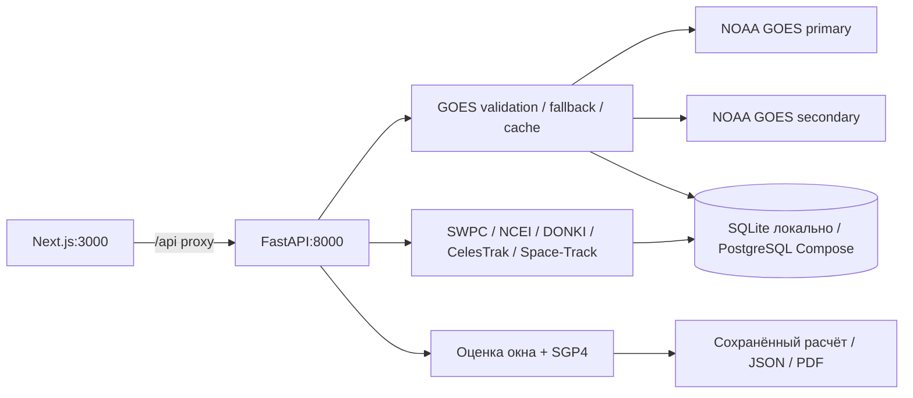

# Orbital Risk — условия ВКД и мониторинг NOAA GOES

Рабочий веб-сервис на Next.js/TypeScript и FastAPI/Python. Получает публичные
данные NOAA, показывает измерения протонов и объясняет оценку, рассчитывает
траекторию МКС и свет/тень, сохраняет сравнение равных окон и экспортирует JSON/PDF.

[Руководство пользователя: параметры, экраны и результаты](docs/USER_GUIDE.md).

## Архитектура



## Что измеряется и как считается статус

- Общая космическая погода: Kp и прогноз R1–R2/R3. Протонные S1-прогнозы и
  proton/radiation warnings исключены из этого фактора.
- Отдельная протонная обстановка: реальные интегральные потоки ≥10, ≥50,
  ≥100 MeV в pfu = particles/(cm²·s·sr). NOAA S-scale по ≥10 MeV:
  <10 → BELOW_S1; 10 → S1; 100 → S2; 1000 → S3; 10000 → S4; 100000 → S5.
  ≥100 MeV ≥1 pfu — отдельное условие внимания.
- Статус приложения: BELOW_S1 → NORMAL; S1 → ATTENTION; S2 → ELEVATED;
  S3 → HIGH; S4/S5 → CRITICAL. Порог ≥100 MeV повышает NORMAL до ATTENTION.
  Недоступные или устаревшие данные дают UNKNOWN, никогда NORMAL.
- NOAA уровень вычислен по измерению и официальным порогам; это не утверждение
  о выпущенном NOAA предупреждении. GOES находится не у МКС; дозы Sv/mSv нет.
- Тренд: медианы двух соседних 30-минутных окон, минимум 4 точки в каждом,
  один спутник; граница изменения max(20% предыдущей медианы, 0.01 pfu).
  Это инженерное описание динамики, не официальный критерий NOAA.
- Для выбранного периода показываются максимумы и время каждого максимума.
  Fluence не рассчитывается: интегральное воздействие не требуется для выбранной
  классификации и не подменяется дозой.
- Протонные измерения покрывают только наблюдённое время. Будущие окна
  оцениваются по официальному прогнозу вероятности S1 и протонным предупреждениям.
  Карточка окна показывает суточную вероятность S1; панель GOES — текущие потоки.
  Архив GOES за 2024 не подключён, но в replay используется исторический
  прогноз S1 NCEI, опубликованный не позже cutoff. Измерения и прогноз не смешиваются.
- Общий результат — объяснимое сравнение факторов без суммы рисков 0–100.
  Неполнота критических факторов исключает уверенного победителя, но сохраняет
  «Оценку с ограничениями» и доступные выводы; при равенстве получается equal.
  Свет/тень — дополнительное условие: отсутствие орбиты не блокирует оценку.
  Орбита: CelesTrak → пригодный кеш с отметкой → Space-Track GP. Эпоха должна
  укладываться в 72 часа для всего интервала расчёта. Окно с горизонтом 0 тоже оценивается.

Сервис является аналитическим инструментом и использует публичные данные
космической погоды. Итоговые показатели не заменяют официальные процедуры
планирования и безопасности EVA.

## Источники и API

[NOAA GOES Proton Flux](https://www.swpc.noaa.gov/products/goes-proton-flux),
[NOAA scales](https://www.swpc.noaa.gov/noaa-scales-explanation).
Оперативные dataset: `https://services.swpc.noaa.gov/json/goes/{primary|secondary}/integral-protons-{6-hour|1-day|3-day|7-day}.json`.
Официальный JSON исследован: time_tag, satellite, energy, flux; units отсутствует,
по контракту данного integral dataset применяется pfu. Если units присутствует,
несовместимая единица отклоняется. Null/NaN/отрицательные значения, неверное время,
конфликтующие дубликаты и будущие измерения не используются.

Primary проверяется первым. Если он недоступен, повреждён, неполон или устарел,
проверяется secondary. Роль и спутник сохраняются. При двойном отказе пригодный
устаревший ряд отображается как DATA_STALE; иначе DATA_UNAVAILABLE. Обновление
каждые 120 секунд, серверный TTL 120 секунд, по 2 попытки, timeout 10 секунд.
Stale — возраст измерения >30 минут (допуск на несколько 5-минутных отсчётов),
а не возраст загрузки. Параметры настраиваются окружением.

| Backend | Назначение |
|---|---|
| GET /health | БД и версия |
| GET /sources/status | Источники, ошибки, последний успех |
| POST /sources/refresh | Обновление с учётом TTL и ограничением частоты |
| GET /protons/current | Последние три канала, статус, тренд, источник |
| GET /protons/history?range=6h | Ряды и пики; также 1d/3d/7d |
| POST /analysis | Расчёт current / historical_replay / historical_review |
| GET /analysis/{id} | Неизменяемый сохранённый результат |
| POST /analysis/{id}/reproduce | Пересчёт без сети по сохранённым ответам |
| GET /analysis/{id}/export.json | JSON того же результата |
| GET /analysis/{id}/report.pdf | PDF того же результата |
| GET /raw/{id} | Первичный источник, кроме приватного Space-Track |
| POST /admin/sources/{id} | enabled/frozen/disabled, Bearer ADMIN_TOKEN |

Браузер использует те же пути с префиксом `/api`; Next.js проксирует на backend.
Секреты доступны только backend. Дополнительно используются SWPC forecast,
alerts/scales; NCEI dated bulletins; NASA DONKI SEP как контекст; CelesTrak ISS GP;
Space-Track GP_HISTORY для исторической орбиты. Подробнее: [источники](docs/SOURCES.md).

## Требования

Python 3.12; Node.js 22+; pnpm 11.19.0; Git. Для PDF: Arial на Windows либо
DejaVu Sans на Linux. Docker Desktop с Compose нужен только для контейнерного
варианта. NOAA и текущая орбита не требуют ключей. Space-Track нужен только для
исторической орбиты. NASA DEMO_KEY доступен без регистрации с лимитами.

## Windows: пошаговый запуск PowerShell

1. Установите Python, Node.js и Git. Откройте PowerShell в папке проекта:

```powershell
cd C:\Users\tvani\OneDrive\Desktop\hakatoncosm
```

Для чистой машины сначала клонируйте:

```powershell
git clone https://github.com/rrawskl/cosmo_hakaton.git
cd cosmo_hakaton
```

2. Создайте окружение и установите backend:

```powershell
python -m venv .venv
.\.venv\Scripts\python.exe -m pip install -r backend/requirements.txt
if (!(Test-Path .env)) { Copy-Item .env.example .env }
notepad .env
```

`.env.example` готов для локальной SQLite. Не заменяйте уже заполненный `.env`.
При необходимости заполните SPACETRACK_USERNAME, SPACETRACK_PASSWORD и собственный
NASA_API_KEY. Для NOAA ничего заполнять не требуется. Пароли не передаются браузеру.

3. Выполните миграции и запустите backend:

```powershell
.\.venv\Scripts\python.exe -m alembic upgrade head
.\.venv\Scripts\python.exe -m uvicorn backend.app.api:app --host 127.0.0.1 --port 8000
```

4. Во втором окне PowerShell установите и запустите frontend:

```powershell
cd C:\Users\tvani\OneDrive\Desktop\hakatoncosm\frontend
npm install --global pnpm@11.19.0
pnpm install --frozen-lockfile
pnpm build
pnpm start --hostname 127.0.0.1
```

При клонировании используйте свою фактическую папку `cosmo_hakaton\frontend`.
Откройте http://127.0.0.1:3000; документация API: http://127.0.0.1:8000/docs.
Остановка — Ctrl+C в обоих окнах. После изменения backend/.env перезапустите его.
Linux/macOS: `.venv/bin/python` вместо `.venv\Scripts\python.exe`, остальные
команды Python/pnpm те же; установите `fonts-dejavu-core` для PDF на Debian/Ubuntu.

## Docker Compose

```powershell
if (!(Test-Path .env)) { Copy-Item .env.example .env }
docker compose config --quiet
docker compose up --build -d
```

Compose задаёт PostgreSQL URL и внутренний API URL самостоятельно; локальные
значения SQLite/127.0.0.1 из .env не мешают. Данные БД сохраняются в volume.
Порты привязаны к localhost. Настройте POSTGRES_PASSWORD в .env для сервера.
Docker недоступен в текущей среде разработки: конфигурация проверена статически,
контейнерный запуск не подтверждён. [Развёртывание](docs/DEPLOYMENT.md).

## Проверки и production build

Из корня:

```powershell
.\.venv\Scripts\python.exe -m pytest backend/tests -q
.\.venv\Scripts\python.exe -m scripts.experiments
cd frontend
pnpm test
pnpm build
$env:PLAYWRIGHT_BROWSERS_PATH = Join-Path (Get-Location) '.browsers'
pnpm exec playwright install chromium
pnpm test:e2e
```

Для E2E должны работать backend:8000 и frontend:3000. Тест live NOAA требует
доступного свежего официального dataset и намеренно не заменяется mock-данными.
Unit/UI граничные тесты используют явно отделённые fixtures; production их не читает.
[Протокол проверок](docs/VALIDATION.md), [отчёт изменений](docs/FINAL_REPORT.md).

## Troubleshooting

- DATA_STALE: проверьте observed_at, возраст и часы компьютера. Обновление
  страницы не меняет времени измерения; secondary выбирается автоматически.
- DATA_UNAVAILABLE: откройте статус источников. Проверьте исходящий HTTPS,
  доступность NOAA и повторите после TTL. Не отключайте TLS-проверку.
- Исторические протоны недоступны: ограничение реализованного rolling API,
  а не ошибка ключа. Старые даты не подменяются текущим рядом.
- Историческая орбита отсутствует: заполните Space-Track в .env либо положите
  разрешённый GP_HISTORY JSON с CREATION_DATE в data/private/gp_history.json.
- Ошибка соединения frontend/backend: проверьте `/health` и API_BASE_URL;
  proxy настраивается при `pnpm build`. Для локального запуска — 127.0.0.1:8000.
- Порт занят: остановите прежний сервер Ctrl+C, затем повторите запуск.
- После смены алгоритма сохранённые расчёты остаются архивными. Пересчёт версии
  1.0.0 новой версией запрещён; создайте новый анализ. БД не стирается.

## GitHub и GitVerse

Целевой origin: https://github.com/rrawskl/cosmo_hakaton.git, ветка main.
Не создавайте другой репозиторий. Проверьте `git status`, `git remote -v`,
`git branch`. `.env`, `.env.*`, *.env, runtime, private, caches и зависимости
исключены; `.env.example` включён. Никогда не добавляйте секреты через `git add -f`.

Для существующего клона после изменений:

```powershell
git status
git add .
git diff --cached --name-only
git commit -m "Implement real NOAA proton monitoring and finalize EVA risk service"
git push -u origin main
```

Если remote нужно исправить: `git remote set-url origin https://github.com/rrawskl/cosmo_hakaton.git`.
Если remote отсутствует: `git remote add origin https://github.com/rrawskl/cosmo_hakaton.git`.
`git init -b main` нужен только папке без `.git`. Для GitVerse добавьте второй
remote `git remote add gitverse <URL-вашего-репозитория>` и `git push -u gitverse main`.
Авторизацию выполняйте штатными средствами Git/GitHub; токены не вставляйте в URL.
